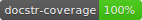

# rawsec_cli
[](https://github.com/mBouamama/rawsec_cli)
[](https://pypi.org/project/rawsec/)
[](https://pypi.org/project/rawsec/)
[](https://pepy.tech/project/rawsec)
[](https://github.com/mBouamama/rawsec_cli/releases)
[](https://rawsec_cli.readthedocs.io/en/latest/?badge=latest)
[](https://github.com/mBouamama/rawsec_cli)
[](https://github.com/HunterMcGushion/docstr_coverage.git)
[](https://results.pre-commit.ci/latest/github/mBouamama/rawsec_cli/main)
[](https://codecov.io/gh/mBouamama/rawsec_cli)
[](https://pyup.io/repos/github/mBouamama/rawsec_cli/)
[](https://snyk.io/test/github/mBouamama/rawsec_cli?targetFile=requirements.txt)
[](https://inventory.raw.pm/tools.html#rawsec_cli)

# Introduction

[Rawsec's Cybersecurity](https://inventory.raw.pm/overview.html) Inventory is an inventory with 4 category(Tools, Resources, Ctf Platforms, OS).
This cli can search a project,list all projects by category, you can filter your research with option --help for more information.
# Table of Contents
- [Features](#features)
- [RoadMap](#roadmap)
- [Installation](#installation)
- [Usage](#usage)
- [Download](#download)
- [Contribute](#contribute)

# Features

- search a project
- list Tools, Resources, Ctf Platforms, OS
- filter by lang, price(Free or not), online or not, present on blackarch

# RoadMap

- [ ] submit command
- [X] Ci/CD
- [X] pypi package
- [X] github issue template
- [X] github action
- [X] better test for unit_test
- [X] docker
- [X] a better documentation

# Installation

To install rawsec-cli, simply use pip:

```
pip install rawsec-cli
```

To run rawsec-cli from a docker image, run:

```
docker run -it docker.pkg.github.com/mbouamama/rawsec_cli/rawsec:latest rawsec-cli --help
```

To install rawsec-cli, on git:

```
git clone https://github.com/mBouamama/rawsec_cli.git
cd ./rawsec_cli
pip install -r requirements.txt
python setup.py install
```

To install rawsec-cli on BlackArch:

```
pacman -S rawsec-cli
```

[](https://repology.org/project/rawsec-cli/versions)

# Usage

## Search

Search command can be used for searching Tools, Resources, Ctf Platforms, OS. All projects will be displayed on a tab .
If your research containing only 1 Result, rawsec will open a new brower tab redirect to source project or website if exist.

### Examples:

You can search by key word, you will see all projects with jwt in their description or name:

```
rawsec-cli search jwt
```

You can search a project, if the Search containing 1 result you will see result in console, and a tab is opened on your browser with redirect to website if informed or source:

```
rawsec-cli search myjwt
```

## List

You can list all projects by category.

### Category List

```
rawsec-cli list
output: 
    ctf
    os
    resources
    tools
```

### Tools

You can list all tools by tool's category.

#### Tools's Category

```
Category available:
        binary_exploitation
        bug_bounty
        code_analysis
        collaboration_report
        configuration_audit
        cracking
        cryptography
        digital_forensics
        honeypot_decoy
        incident_response
        intentionally_vulnerable_applications
        networking
        osint
        other
        plugins
        red_teaming
        reverse_engineering
        steganography
        system_exploitation
        threat_intelligence
        vulnerability_assessment
        web_application_exploitation
        wireless
```

#### Examples:

List all tools:

```
rawsec-cli list tools 
```

List all [binary exploitation tools](#toolss-category):

 ```
rawsec-cli list tools binary_exploitation
```

### Resources

You can list all tools by Resources's category.

#### Resources's Category

```
Category available:
        bug_bounty_and_disclosure_platforms
        challenges_platforms
        cve
        events
        information
        knowledge_and_tools
        national_security_agencies_and_services
        non_english
        trainings_and_courses
        tutorials
        writeups_collections_and_challenges_source
```

#### Examples:

List all resources:

```
rawsec-cli list resources  
```

List all [events resources](#resourcess-category):

 ```
rawsec-cli list resources events
```

### CTF

You can list all ctf by ctf's category.

#### CTF's Category

```
Category available:
        attack_defense
        hybrid
        jeopardy
```

#### Examples:

List all ctf:

```
rawsec-cli list ctf  
```

List all [attack_defense ctf](#ctfs-category):
```
rawsec-cli list ctf attack_defense
```

### OS

You can list all tools by OS's category.

#### OS's Category

```
Category available:
        maintained
        no_more_maintained
        project_transferred
```

#### Examples:

List all os:

```
rawsec-cli list os  
```

List all [maintained os](#oss-category):
```
rawsec-cli list os maintained
```

## Options
## rawsec-cli
| command            | type           | description                                              |
| ------------------ | -------------- | ---------------------------------------------------------|
| -V, --version      | None           | show version.                                            |
| -h, --help         | None           | Show  help message and exit.                             |

## search
| command            | type           | description                                              |
| ------------------ | -------------- | ---------------------------------------------------------|
| -l, --lang         | None           | Filter by Language                                       |
| -p, --paid         | None           | Filter by Price, when price is equal to paid             |
| -f, --free         | None           | Filter by Price, when price is equal to free             |
| -on, --online      | None           | Filter by Online, when online is equal to true           |
| -off, --offline    | None           | Filter by Online, when online is equal to false          |
| -b, --blackarch    | None           | Filter by Blackarch when package is present on Blackarch |
| -o, --output       | json,csv,table | Output format                                            |
| -of, --output-file | file path      | Output file name if you want.                            |
| -h, --help         | None           | Show search help message and exit.                       |

## list
### tools
| command            | type           | description                                              |
| ------------------ | -------------- | ---------------------------------------------------------|
| -l, --lang         | None           | Filter by Language                                       |
| -p, --paid         | None           | Filter by Price, when price is equal to paid             |
| -f, --free         | None           | Filter by Price, when price is equal to free             |
| -on, --online      | None           | Filter by Online, when online is equal to true           |
| -off, --offline    | None           | Filter by Online, when online is equal to false          |
| -b, --blackarch    | None           | Filter by Blackarch when package is present on Blackarch |
| -o, --output       | json,csv,table | Output format                                            |
| -of, --output-file | file path      | Output file name if you want.                            |
| -h, --help         | None           | Show list tools help message and exit.                   |

### resources
| command            | type           | description                                              |
| ------------------ | -------------- | ---------------------------------------------------------|
| -p, --paid         | None           | Filter by Price, when price is equal to paid             |
| -f, --free         | None           | Filter by Price, when price is equal to free             |
| -o, --output       | json,csv,table | Output format                                            |
| -of, --output-file | file path      | Output file name if you want.                            |
| -h, --help         | None           | Show list resources help message and exit.               |

### ctf
| command            | type           | description                                              |
| ------------------ | -------------- | ---------------------------------------------------------|
| -l, --lang         | None           | Filter by Language                                       |
| -p, --paid         | None           | Filter by Price, when price is equal to paid             |
| -f, --free         | None           | Filter by Price, when price is equal to free             |
| -o, --output       | json,csv,table | Output format                                            |
| -of, --output-file | file path      | Output file name if you want.                            |
| -h, --help         | None           | Show list ctf help message and exit.                     |

### os
| command            | type           | description                                              |
| ------------------ | -------------- | ---------------------------------------------------------|
| -b, --base         | Text           | Filter by base(ex: Linux)                                |
| -o, --output       | json,csv,table | Output format                                            |
| -of, --output-file | file path      | Output file name if you want.                            |
| -h, --help         | None           | Show list ctf help message and exit.                     |

# Download

Check github releases. Latest is available at https://github.com/mBouamama/rawsec_cli/releases/latest

# Thanks 

See [THANKS.md](https://github.com/mBouamama/rawsec_cli/blob/master/THANKS.md).

# Contribute

- Fork this repository or clone it
- Create a new branch (feature, hotfix, etc...)
- Make necessary changes and commit those changes
- Check lint with `make lint`
- Check unit_test with `make test`
- Send Pull Request
I will check as Soon as Possible.

# Change log

The log's become rather long. It moved to its own file.

See [CHANGES](https://github.com/mBouamama/rawsec_cli/blob/master/CHANGELOG.md).
